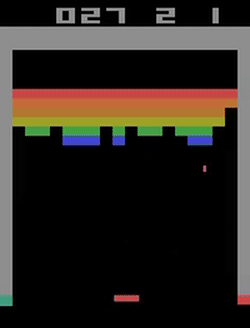
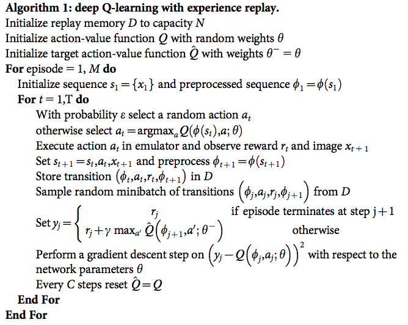
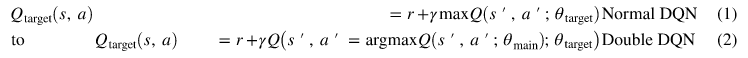

# Deep Q Learning on Breakout


## Using Deep Q Learning on the OpenAI's BreakoutDeterministic-v4 environment

On this project, I trained an AI Agent with **Deep Q Learning** on the OpenAI's [BreakoutDeterministic-v4](https://gym.openai.com/envs/Breakout-v0/) Environment.
<br><br>In Breakout, a layer of bricks lines the top third of the screen and the goal is **to destroy them all**. A ball moves straight around the screen, bouncing off the top and two sides of the screen. When a brick is hit, the ball bounces back and the brick is destroyed. The player loses a turn when the ball touches the bottom of the screen; to prevent this from happening, the player has a **horizontally movable paddle to bounce the ball upward, keeping it in play**. 

<p align="center">
  
</p>

## Observation preprocessing

On OpenAI Gym's BreakoutDeterministic-v4 environment the observation is an RGB image of the screen, which is an array of shape (210, 160, 3). To preprocess this input, I followed [Mnih et al. 2013](https://arxiv.org/pdf/1312.5602.pdf) recommendations:

>Working directly with raw Atari frames, which are 210×160 pixel images with a 128 color palette,can be computationally demanding, so we apply a basic preprocessing step aimed at reducing theinput dimensionality. The raw frames are preprocessed by first converting their RGB representationto gray-scale and down-sampling it to a 110×84 image. The final input representation is obtained by cropping an 84×84 region of the image that roughly captures the playing area. The final croppingstage is only required because we use the GPU implementation of 2D convolutions from [11], which expects square inputs. For the experiments in this paper, the function φ from algorithm 1 applies this preprocessing to the last 4 frames of a history and stacks them to produce the input to the Q-function

This preprocessing process can be found on the environment wrapper [breakout.py](https://github.com/glacasellaUANDES/DoubleDeepQLearning_BreakoutProblem/blob/master/Utils/breakout.py).


## Algorithm used

The algorithm used in this project is taken from [Mnih et al. 2013](https://arxiv.org/pdf/1312.5602.pdf). It initializes replay memory with some capacity and creates two Neural Networks: action-value function and a target action-value function, both with random weights. Then, it preprocesses a sequence of frames, and using an epsilon-greedy-descendant algorithm selects a random action or the best action selected by the action-value function. Executes the action on the environment, gets its reward and next image and then preprocesses the next frames sequence. Once done, stores the transition on the memory (a transition is given by a sequence, action performed, reward, and next sequence). 

<p align="center">
  
</p>

Then, takes a "random minibatch" from the memory to replay, calculates the target network predicted q-value, and perform gradient descent step on the networks prediction difference with respect to the action-value function parameters. It is important to notice that the target neural network is predicting the q-value of the best action on the "next sequence". On the image below can be seen how the temporal difference changes from a Normal Deep Q Network to a Double Deep Q Network.

<p align="center">
  
</p>

At last, every C steps resets the target neural network.

It is important to emphasize that a "sequence" is given by a stack of 4 84x84x1 frames (already preprocessed).

## Convolutional Neural Network description

The CNN arquitecture is also taken from [Mnih et al. 2013](https://arxiv.org/pdf/1312.5602.pdf):

>The first hidden layer convolves16 8×8 filters with stride 4 with the input image and applies a rectifier nonlinearity [10, 18].  The second hidden layer convolves 32 4×4 filters with stride 2, again followed by a rectifier nonlinearity. The final hidden layer is fully-connected and consists of 256 rectifier units.  The output layer is a fully-connected linear layer with a single output for each valid action

## Modifications I made to the algorithm

* Modified the action space: the original environment action space is given by ['NOOP', 'FIRE', 'RIGHT', 'LEFT'], but I removed the 'FIRE' option. On each episode, the wrapper makes the 'FIRE' action. Then, the action space is reduced to: ['NOOP', 'LEFT', 'RIGHT']

* Added through the environment wrapper a negative reward when the agent loses a life

* Modified the way memories are stored: only stores 'good' (transitions that leads to a positive reward) and 'bad' memories  (transitions that leads to a negative reward)


## My results

Unfortunately, my PC doesn't have the computational capability to train this agent for days, and get to the 300.000 iterations suggested on the parameters.json file. I tried training it for a day, and got some encouraging results.

## Prerequisites

* Python 3.5
* Numpy
* Pytorch
* OpenAI Gym

## Getting started

Clone this repository, and open the Terminal/Command Prompt inside the folder. You can costumize the learning parameters on parameters.json. Then, execute the main.py script:


```
python main.py
```

It will save on a .txt the mean reward of each epoch.


## What I learned

* To use Neural Networks with Pytorch
* To use Convolutional Neural Networks with Pytorch
* Some tensorial algebra
* Classical approach to Deep Q Learning (Normal Deep Q Network)
* A more advanced approach to Deep Q Learning (Double Deep Q Network)
* Preprocess images to make them less computationally demanding for a CNN
* How to store 'memories' to make them replayable by the agent

## Authors

* **Gianfranco Lacasella** - *Initial work* - [glacasellaUANDES](https://github.com/glacasellaUANDES)

## License

This project is licensed under the GNU GENERAL PUBLIC LICENSE- see the [LICENSE.md](LICENSE.md) file for details
